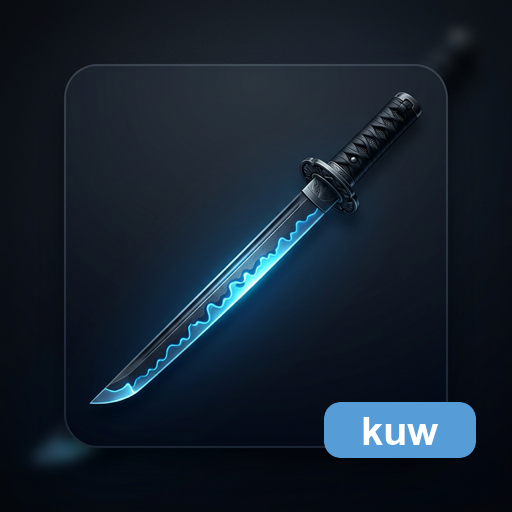

<p align="center">
  
</p>

<h1 align="center">katana-ui-core</h1>

<p align="center">
  KatanAエコシステム向けのフレームワーク非依存（framework-neutral）UI Core.
</p>

<p align="center">
  <a href="LICENSE"></a>
  <a href="https://github.com/HiroyukiFuruno/katana-ui-core/actions/workflows/test-and-build.yml"></a>
  <a href="https://github.com/HiroyukiFuruno/katana-ui-core/releases/latest"></a>
  <a href="https://crates.io/crates/katana-ui-core"></a>
  <a href="https://docs.rs/katana-ui-core"></a>
</p>

---

## 目的

`katana-ui-core` は、KatanAエコシステム向けのフレームワーク非依存（framework-neutral）UI Coreを管理するリポジトリです。

画面部品（widget）だけでなく、起動、窓、描画面、テーマ、イベント、描画モデル、外部変換層向けの中立契約を扱います。
特定の UI framework は中核（core）の依存に含めません。
UI ごとの状態（state）は component 内部 model で管理し、同じ種類・同じ label の UI が複数あっても一意に識別します。

現在の主な実装対象は、利用側が組み合わせて UI を構築するための最小部品（atoms）と組み合わせ部品（molecules）です。
画面（pages）や画面ひな形（templates）は将来の拡張対象であり、現時点の公開スコープではありません。
折りたたみ可能なパネル（CollapsiblePanel）は molecule として提供しますが、アプリ全体の枠（AppShell）や画面テンプレートは公開 API に含めません。利用側は `SplitPane`、`Toolbar`、`StatusBar`、`CollapsiblePanel` などを組み合わせて shell を構築します。
次フェーズの正本は [`openspec/changes/establish-kuc-atoms-molecules-catalog/`](openspec/changes/establish-kuc-atoms-molecules-catalog/) です。

## Core 階層と依存方向

```
theme / event / render_model
  ← atom
  ← molecule
  ← layout
  ← runtime / window / surface
```

| 階層 | パス | 依存可能な層 |
|---|---|---|
| `theme` | `src/theme/` | なし |
| `event` | `src/event/` | theme なし、KUC DTO のみ |
| `render_model` | `src/render_model/` | theme, event |
| `atom` | `src/atom/` | theme, event, render_model |
| `molecule` | `src/molecule/` | theme, event, render_model, atom |
| `layout` | `src/layout/` | theme, event, render_model, atom, molecule |
| `runtime` / `window` / `surface` | `src/runtime/`, `src/window/`, `src/surface/` | KUC DTO / trait のみ |

詳細は [`docs/directory-structure.md`](docs/directory-structure.md) を参照。

## Framework 方針

`katana-ui-core` の中核 crate（core crate）は framework-specific UI に依存しません。
framework-specific な接続は、中立 DTO / trait / render model を消費する独立 adapter crate に閉じます。

| crate | 役割 | 公開 |
|---|---|---|
| `katana-ui-core` | framework-neutral な UI model / state / event / render contract | crates.io |
| `katana-ui-core-text-raster` | platform font、color emoji、grapheme、RGBA text raster | crates.io |
| `katana-ui-core-svg-raster` | renderer-neutral な SVG icon raster | crates.io |
| `katana-ui-core-egui-adapter` | KUC contract と egui input / output の接続 | crates.io |
| `katana-ui-core-storybook` | 実部品を操作する private harness | 非公開 |
| `kuc-consumer-app` | framework-neutral consumer contract | 非公開 |

release gate は4つの公開crateとprivate consumer / Storybookの契約をまとめて検証します。

OS ネイティブのドラッグ&ドロップ（native drag and drop）は、中核 crate に OS 固有型を持ち込みません。
外部変換層は OS ファイル一覧、URL、テキストを `os/file-list`、`os/url`、`os/text` の `DragData` に変換し、`NativeDragDropBridge` 経由で `DragStart` / `Drop` / `DragCancel` を KUC event に渡します。

## Storybook

`katana-ui-core` が提供する部品を実画面で触り、見た目、操作感、設定変更時の振る舞いへフィードバックするための画面です。
左ペインは KUC 自身の TreeView で部品を分類表示し、各部品ページは preview、settings、Tabs による preset 切替、状態（state）・イベント（event）・操作（action）の履歴を持ちます。
Storybook は完了判定の根拠ではありません。部品の正しさは自動テスト、数値化された layout / rendering contract、入力回帰、静的検査（guard）で判定します。

```bash
# Storybook を起動
just storybook

# コンパイル確認のみ（CI用）
just storybook-check
```

## 品質ゲート

```bash
# 全チェック（fmt / types / lint / ast-lint / tests）
just check

# ast-lint インストール（初回のみ）
just ast-lint-install
```

## ドキュメント

- [`openspec/changes/establish-kuc-atoms-molecules-catalog/`](openspec/changes/establish-kuc-atoms-molecules-catalog/) — atoms / molecules と Storybook 実装の正本 change
- [`docs/architecture/ui-separation/root-plan-source.md`](docs/architecture/ui-separation/root-plan-source.md) — KUC repo内にコピーしたroot計画
- [`docs/architecture/ui-separation/implementation-notes.md`](docs/architecture/ui-separation/implementation-notes.md) — workspace 構成と旧実装の扱い
- [`docs/adr/0002-katana-ui-core-rename.md`](docs/adr/0002-katana-ui-core-rename.md) — KUC renameとruntime/window/surface責務
- [`docs/dependency-policy.md`](docs/dependency-policy.md) — core / adapter の依存境界
- [`docs/directory-structure.md`](docs/directory-structure.md) — 階層図と依存方向
- [`docs/widget-extraction-policy.md`](docs/widget-extraction-policy.md) — 抽出対象の判断軸
- [`docs/release.md`](docs/release.md) — リリース手順
- [`CONTRIBUTING.md`](CONTRIBUTING.md) / [`CONTRIBUTING.ja.md`](CONTRIBUTING.ja.md) — 貢献ガイド

## 作業入口

新規実装は [`openspec/changes/ui-core-root-plan/`](openspec/changes/ui-core-root-plan/) で親設計を確認した後、[`openspec/changes/establish-kuc-atoms-molecules-catalog/`](openspec/changes/establish-kuc-atoms-molecules-catalog/) を実装元にする。
旧個別 change の完了チェックは履歴であり、現在の KUC 完了根拠にしない。
